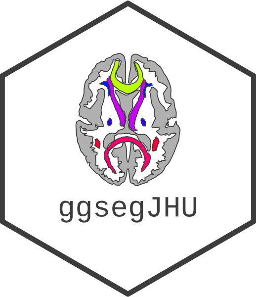
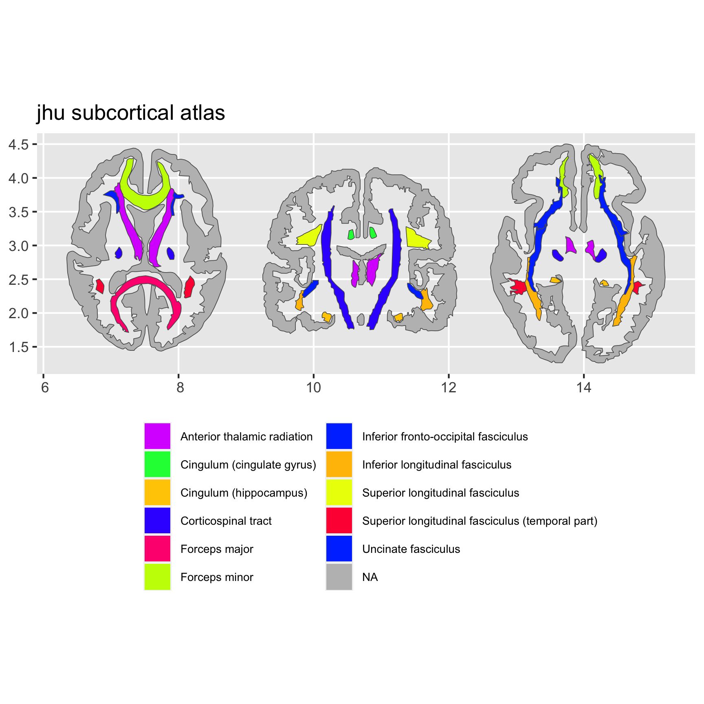

<!-- README.md is generated from README.Rmd. Please edit that file -->

# ggsegJHU 

<!-- badges: start -->

[](https://zenodo.org/badge/latestdoi/250280074)
[](https://codecov.io/gh/LCBC-UiO/ggsegJHU?branch=master)
[](https://github.com/LCBC-UiO/ggsegJHU/actions)
<!-- badges: end -->

Contains data for ggseg and ggseg3d for the JHU white matter
segmentation.

Hua et al. (2008) NeuroImage, 39(1):336-347
[pubmed](https://www.ncbi.nlm.nih.gov/pmc/articles/PMC2724595/)

## Installation

We recommend installing the ggseg-atlases through the ggseg
[r-universe](https://ggseg.r-universe.dev/ui#builds):

``` r
# Enable this universe
options(repos = c(
    ggseg = 'https://ggseg.r-universe.dev',
    CRAN = 'https://cloud.r-project.org'))

# Install some packages
install.packages('ggsegJHU')
```

You can install the development version from
[GitHub](https://github.com/) with:

``` r
# install.packages("devtools")
devtools::install_github("LCBC-UiO/ggsegJHU")
```

## Example

This is a basic example which shows you how to solve a common problem:

``` r
library(ggsegJHU)
```

``` r
library(ggseg)
library(ggplot2)

plot(jhu) +
  theme(legend.position = "bottom",
        legend.text = element_text(size = 7)) +
  guides(fill = guide_legend(ncol = 2))
```



``` r
library(ggseg3d)
library(dplyr)

ggseg3d(atlas = jhu_3d) %>% 
  add_glassbrain("left") %>% 
  pan_camera("right lateral")
```


Please note that the ‘ggsegJHU’ project is released with a [Contributor
Code of Conduct](CODE_OF_CONDUCT.md). By contributing to this project,
you agree to abide by its terms.
